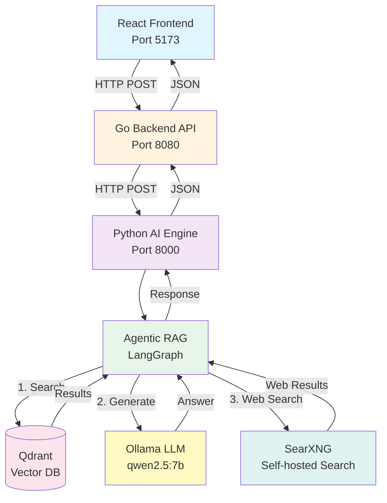
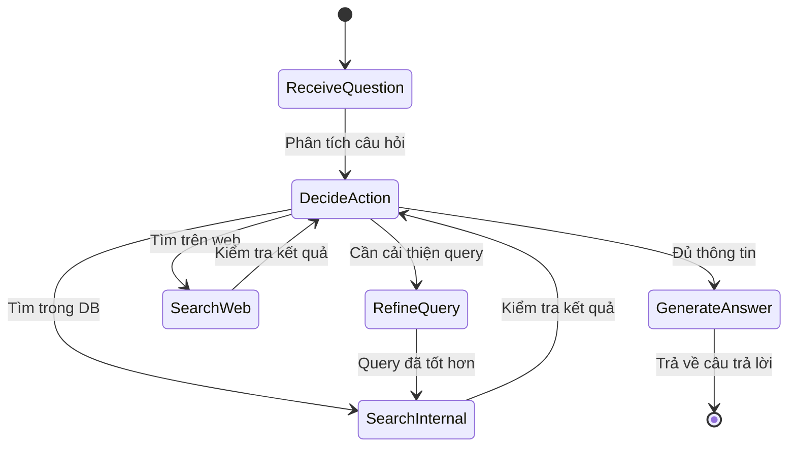

# Legal RAG - Hệ Thống Trợ Lý Pháp Lý Thông Minh

Hệ thống RAG (Retrieval-Augmented Generation) sử dụng AI để trả lời các câu hỏi về pháp luật Việt Nam một cách chính xác và có nguồn gốc.

## 📋 Mục Lục

- [Giới Thiệu](#-giới-thiệu)
- [Quick Start với Docker](#-quick-start-với-docker)
- [Kiến Trúc Hệ Thống](#️-kiến-trúc-hệ-thống)
- [Công Nghệ Sử Dụng](#️-công-nghệ-sử-dụng)
- [Cách Hoạt Động](#️-cách-hoạt-động)
- [Cài Đặt](#-cài-đặt)
- [Sử Dụng](#-sử-dụng)
- [Cấu Trúc Project](#-cấu-trúc-project)
- [API Documentation](#-api-documentation)
- [Configuration](#-configuration)

---

## 🎯 Giới Thiệu

### Vấn Đề Cần Giải Quyết

Việc tra cứu và hiểu các quy định pháp luật Việt Nam thường gặp nhiều khó khăn:
- **Khối lượng lớn**: Hàng nghìn điều luật, nghị định, thông tư
- **Ngôn ngữ phức tạp**: Thuật ngữ pháp lý khó hiểu
- **Tìm kiếm khó khăn**: Không biết tìm ở đâu, điều nào
- **Thông tin lỗi thời**: Luật thay đổi liên tục

### Giải Pháp

**Legal RAG** là hệ thống AI kết hợp:
1. **Retrieval**: Tìm kiếm thông minh trong cơ sở dữ liệu pháp luật
2. **Generation**: Tạo câu trả lời dễ hiểu bằng AI
3. **Agentic**: Tự động quyết định cách tìm kiếm tốt nhất
4. **Web Search**: Tìm kiếm thông tin mới nhất trên internet (self-hosted)

**Kết quả**: Trả lời chính xác, có trích dẫn điều luật cụ thể, dễ hiểu.

---

## 🐳 Quick Start với Docker

**Cách nhanh nhất để chạy toàn bộ hệ thống!**

### Prerequisites
- Docker & Docker Compose
- (Optional) NVIDIA GPU + nvidia-docker cho Ollama

### Bước 1: Clone và Start

```bash
# Clone repository
git clone <repository-url>
cd Legal-RAG

# Start tất cả services
docker-compose up -d

# Xem logs
docker-compose logs -f
```

### Bước 2: Initialize

```bash
# Pull Ollama model và ingest data
./docker-init.sh
```

### Bước 3: Test

```bash
curl -X POST http://localhost:8080/api/legal-query \
  -H "Content-Type: application/json" \
  -d '{"question": "Thời gian thử việc tối đa bao nhiêu ngày?"}'
```

### Services Running

- **Frontend UI**: http://localhost:5173
- **Backend API**: http://localhost:8080
- **AI Engine**: http://localhost:8000
- **Qdrant**: http://localhost:6333
- **Ollama**: http://localhost:11434
- **SearXNG**: http://localhost:8888

### Useful Commands

```bash
# Stop services
docker-compose down

# Rebuild images
docker-compose build

# View logs
docker-compose logs -f [service-name]

# Restart a service
docker-compose restart [service-name]

# Remove all data (volumes)
docker-compose down -v
```

### GPU Support (Optional)

Nếu bạn có NVIDIA GPU, uncomment phần GPU trong `docker-compose.yml`:

```yaml
# ollama service
deploy:
  resources:
    reservations:
      devices:
        - driver: nvidia
          count: 1
          capabilities: [gpu]
```

---

## 🏗️ Kiến Trúc Hệ Thống

### Tổng Quan



### Các Thành Phần

#### 0. **React Frontend** (Port 5173)
- **Vai trò**: Giao diện người dùng tương tác
- **Công nghệ**: React + TypeScript + Vite + TailwindCSS
- **Chức năng**:
  - Gửi câu hỏi và hiển thị câu trả lời
  - Trực quan hóa quá trình suy luận (Reasoning)
  - Hiển thị nguồn trích dẫn pháp lý và kết quả Web
  - Tùy chỉnh cấu hình AI (Max iterations, TopK)

#### 1. **Go Backend API** (Port 8080)
- **Vai trò**: Gateway giữa client và AI engine
- **Công nghệ**: Go + Gin framework
- **Chức năng**:
  - Nhận request từ client
  - Validate và forward đến Python
  - Trả response về client
  - Health check

#### 2. **Python AI Engine** (Port 8000)
- **Vai trò**: Xử lý logic AI và RAG
- **Công nghệ**: Python + FastAPI
- **Chức năng**:
  - Expose HTTP API
  - Chạy Agentic RAG workflow
  - Quản lý kết nối với Qdrant, Ollama, SearXNG

#### 3. **Agentic RAG** (LangGraph)
- **Vai trò**: "Bộ não" của hệ thống
- **Công nghệ**: LangGraph + LangChain
- **Chức năng**:
  - Quyết định chiến lược tìm kiếm
  - Tinh chỉnh query nếu cần
  - Kết hợp nhiều nguồn thông tin
  - Tạo câu trả lời cuối cùng

#### 4. **Qdrant Vector Database**
- **Vai trò**: Lưu trữ và tìm kiếm văn bản pháp luật
- **Công nghệ**: Qdrant (vector similarity search)
- **Dữ liệu**: Embedding của các điều luật Việt Nam

#### 5. **Ollama LLM**
- **Vai trò**: Tạo câu trả lời tự nhiên
- **Model**: qwen2.5:7b (Vietnamese-capable)
- **Chức năng**:
  - Phân tích câu hỏi
  - Quyết định hành động
  - Tạo câu trả lời từ kết quả tìm kiếm

#### 6. **SearXNG** (Self-hosted Search Engine)
- **Vai trò**: Tìm kiếm thông tin mới nhất trên internet
- **Công nghệ**: SearXNG metasearch engine
- **Ưu điểm**:
  - 🆓 Hoàn toàn miễn phí, không cần API key
  - 🔒 Riêng tư, tất cả search chạy local
  - ⚡ Không giới hạn số lượng search
  - 🇻🇳 Hỗ trợ tiếng Việt tốt
  - 🔍 Tổng hợp từ nhiều search engines (Google, Bing, DuckDuckGo, Brave...)

---

## 🛠️ Công Nghệ Sử Dụng

### Frontend
- **React 18+**: UI Library
- **TypeScript**: Static typing
- **Vite**: Build tool & dev server
- **TailwindCSS v4**: Styling
- **Framer Motion**: Animations
- **Lucide React**: Icons
- **Axios**: HTTP Client

### Backend
- **Go 1.21+**: Backend API gateway
  - `gin-gonic/gin`: Web framework
- **Python 3.8+**: AI Engine
  - `fastapi`: HTTP API framework
  - `uvicorn`: ASGI server

### AI/ML Stack
- **LangGraph**: Agentic workflow orchestration
- **LangChain**: LLM application framework
- **Sentence Transformers**: Vietnamese text embedding
- **Qdrant**: Vector database
- **Ollama**: Local LLM inference

### Search
- **SearXNG**: Self-hosted metasearch engine
  - Privacy-focused
  - No API costs
  - Aggregates results from multiple engines

---

## ⚙️ Cách Hoạt Động

### Workflow Chi Tiết



### Các Bước Xử Lý

1. **Nhận Câu Hỏi**
   ```
   Client → Go API → Python API → Agentic RAG
   ```

2. **Decide Action** (Quyết định hành động)
   - LLM phân tích câu hỏi
   - Quyết định: search, refine, hoặc answer
   - Ví dụ: "Thời gian thử việc tối đa?" → search

3. **Search** (Tìm kiếm)
   - **Internal Search**: Tìm trong Qdrant DB
     - Embedding câu hỏi
     - Similarity search
     - Lấy top-k kết quả
   - **Web Search**: Tìm trên internet qua SearXNG
     - Tự động trigger khi cần thông tin mới nhất
     - Tổng hợp từ nhiều search engines
     - Hỗ trợ tiếng Việt

4. **Refine Query** (Tinh chỉnh - nếu cần)
   - LLM phân tích kết quả hiện tại
   - Tạo query tốt hơn
   - Ví dụ: "thử việc" → "thời gian thử việc Bộ luật Lao động"

5. **Generate Answer** (Tạo câu trả lời)
   - LLM đọc tất cả kết quả tìm được
   - Tổng hợp thông tin từ cả DB nội bộ và web
   - Tạo câu trả lời có cấu trúc:
     - Các điều luật liên quan
     - Phân tích chi tiết
     - Lưu ý (nếu có)

6. **Return Response**
   ```
   Agentic RAG → Python API → Go API → React Frontend
   ```

### Ví Dụ Cụ Thể

**Input**:
```json
{
  "question": "Thời gian thử việc tối đa bao nhiêu ngày?"
}
```

**Processing**:
1. Decide: Search trong DB
2. Search: Tìm thấy Điều 25 Bộ luật Lao động
3. Decide: Đủ thông tin → Generate answer
4. Generate: Tạo câu trả lời có cấu trúc

**Output**:
```json
{
  "answer": "1. Các điều luật liên quan:\n   - Điều 25, Khoản 2...\n\n2. Phân tích:\n   - 60 ngày cho trình độ cao đẳng+\n   - 30 ngày cho trình độ trung cấp...",
  "iterations": 2,
  "search_results": [...],
  "web_results": [...]
}
```

---

## 📦 Cài Đặt

### Prerequisites

1. **Go 1.21+**
   ```bash
   go version
   ```

2. **Python 3.8+**
   ```bash
   python --version
   ```

3. **Qdrant** (Vector Database)
   ```bash
   docker run -p 6333:6333 qdrant/qdrant
   ```

4. **Ollama** (LLM)
   ```bash
   # Install Ollama
   curl -fsSL https://ollama.com/install.sh | sh
   
   # Pull model
   ollama pull qwen2.5:7b
   
   # Start server
   ollama serve
   ```

5. **SearXNG** (Search Engine)
   ```bash
   # Included in docker-compose.yml
   docker-compose up -d searxng
   ```

### Installation Steps

1. **Clone Repository**
   ```bash
   git clone <repository-url>
   cd Legal-RAG
   ```

2. **Setup Python AI Engine**
   ```bash
   cd ai-engine
   
   # Install dependencies
   pip install -r requirements.txt
   
   # Configure environment
   cp .env.example .env
   # Edit .env with your settings
   
   # Ingest data (first time only)
   python run_embedding.py
   ```

3. **Setup Go Backend**
   ```bash
   cd ../backend-api
   
   # Install dependencies
   go mod download
   
   # Configure environment (optional)
   cp .env.example .env
   ```

4. **Setup React Frontend**
   ```bash
   cd ../frontend
   
   # Install dependencies
   npm install
   ```

---

## 🚀 Sử Dụng

### Starting Services

**Terminal 1 - Qdrant** (if not using Docker):
```bash
docker run -p 6333:6333 qdrant/qdrant
```

**Terminal 2 - SearXNG**:
```bash
docker-compose up -d searxng
# Access web UI: http://localhost:8888
```

**Terminal 3 - Ollama**:
```bash
ollama serve
```

**Terminal 4 - Python AI Engine**:
```bash
cd ai-engine
python api_server.py
# Server running on http://localhost:8000
```

**Terminal 5 - Go Backend**:
```bash
cd backend-api
go run main.go
# Server running on http://localhost:8080
```

**Terminal 6 - React Frontend**:
```bash
cd frontend
npm run dev
# App running on http://localhost:5173
```

### Making Queries

#### Using curl

```bash
curl -X POST http://localhost:8080/api/legal-query \
  -H "Content-Type: application/json" \
  -d '{
    "question": "Quy định về nghỉ phép năm là gì?"
  }'
```

#### Using Python

```python
import requests

response = requests.post(
    "http://localhost:8080/api/legal-query",
    json={"question": "Thời gian thử việc tối đa bao nhiêu ngày?"}
)

result = response.json()
print(result["answer"])
```

#### Using JavaScript

```javascript
fetch('http://localhost:8080/api/legal-query', {
  method: 'POST',
  headers: {'Content-Type': 'application/json'},
  body: JSON.stringify({
    question: 'Lương tối thiểu vùng 1 là bao nhiêu?'
  })
})
.then(res => res.json())
.then(data => console.log(data.answer));
```

### Advanced Options

```bash
curl -X POST http://localhost:8080/api/legal-query \
  -H "Content-Type: application/json" \
  -d '{
    "question": "Quy định về bảo hiểm xã hội",
    "max_iterations": 3,
    "top_k": 5,
    "enable_web_search": true
  }'
```

---

## 📁 Cấu Trúc Project

```
Legal-RAG/
├── README.md                    # Documentation này
├── docker-compose.yml           # Docker setup
├── test_http_integration.sh     # Integration test script
│
├── frontend/                    # React Frontend (Vite + TS)
│   ├── src/
│   │   ├── api/                # API Client services
│   │   ├── components/         # UI Components
│   │   ├── hooks/              # Custom hooks (Chat, etc.)
│   │   └── App.tsx             # Main Application
│   └── package.json
│
├── searxng/                     # SearXNG configuration
│   └── settings.yml            # Search engine settings
│
├── ai-engine/                   # Python AI Engine
│   ├── api_server.py           # FastAPI HTTP server
│   ├── run_embedding.py        # Data ingestion tool
│   ├── requirements.txt        # Python dependencies
│   ├── .env.example            # Config template
│   │
│   ├── core/                   # Core modules
│   │   ├── agentic_rag.py     # Agentic RAG logic (LangGraph)
│   │   ├── search.py          # Search logic
│   │   ├── llm_generator.py   # LLM wrapper
│   │   ├── prompt_templates.py # Prompt templates
│   │   └── web_search.py      # Web search (SearXNG)
│   │
│   ├── embedding/              # Embedding modules
│   │   ├── embedder.py        # Vietnamese embedder
│   │   └── ...
│   │
│   └── data/                   # Data directory
│       └── legal_documents/    # Source documents
│
└── backend-api/                # Go Backend API
    ├── main.go                 # Main server
    ├── go.mod                  # Go dependencies
    ├── .env.example            # Config template
    └── README.md               # Backend documentation
```

### Key Files Explained

| File | Mô Tả |
|------|-------|
| `ai-engine/api_server.py` | HTTP server expose Agentic RAG |
| `ai-engine/core/agentic_rag.py` | LangGraph workflow - "bộ não" của hệ thống |
| `ai-engine/core/search.py` | Tìm kiếm trong Qdrant vector DB |
| `ai-engine/core/web_search.py` | Tìm kiếm web qua SearXNG |
| `ai-engine/run_embedding.py` | Ingest documents vào Qdrant |
| `backend-api/main.go` | Go API gateway |
| `searxng/settings.yml` | Cấu hình SearXNG search engine |

---

## 📚 API Documentation

### Endpoints

#### Go Backend API (Port 8080)

**POST /api/legal-query**
- Main endpoint cho client
- Request: `{"question": "string", ...}`
- Response: `{"answer": "string", "search_results": [...], "web_results": [...], ...}`

**GET /health**
- Health check
- Response: `{"status": "healthy", ...}`

#### Python AI Engine (Port 8000)

**POST /api/query**
- Internal endpoint (called by Go backend)
- Same request/response format

**GET /docs**
- Auto-generated OpenAPI documentation
- Visit: http://localhost:8000/docs

#### SearXNG (Port 8888)

**Web UI**
- Visit: http://localhost:8888
- Interactive search interface

**POST /search**
- JSON API endpoint
- Used internally by web_search.py

### Request Schema

```json
{
  "question": "string (required)",
  "max_iterations": 3,
  "top_k": 3,
  "enable_web_search": true
}
```

### Response Schema

```json
{
  "answer": "string",
  "search_results": [
    {
      "text": "string",
      "metadata": {
        "article_id": "string",
        "article_title": "string"
      },
      "score": 0.95,
      "source_type": "internal"
    }
  ],
  "web_results": [
    {
      "title": "string",
      "url": "string",
      "content": "string",
      "score": 0.9,
      "source_type": "web",
      "engine": "duckduckgo"
    }
  ],
  "iterations": 2,
  "query_used": "string"
}
```

---

## 🔧 Configuration

### Environment Variables

#### Python AI Engine

```bash
# Qdrant Configuration
QDRANT_URL=http://localhost:6333
COLLECTION_NAME=legal_documents

# Ollama Configuration
OLLAMA_URL=http://127.0.0.1:11434
OLLAMA_MODEL=qwen2.5:7b

# SearXNG Configuration (for web search)
SEARXNG_URL=http://localhost:8888

# Embedding Model
EMBEDDING_MODEL=bkai-foundation-models/vietnamese-bi-encoder
```

#### Go Backend

```bash
GO_SERVER_PORT=8080
PYTHON_AI_ENGINE_URL=http://localhost:8000
REQUEST_TIMEOUT=60s
```

#### SearXNG

Edit `searxng/settings.yml`:

```yaml
server:
  secret_key: "your-secret-key"  # Change in production
  limiter: false  # Disable rate limiting for internal use

search:
  default_lang: "all"
  formats:
    - html
    - json
```

---

## 🧪 Testing

### Integration Test

```bash
./test_http_integration.sh
```

This script tests:
1. Python AI Engine health
2. Go Backend health
3. SearXNG availability
4. Direct Python query
5. Full integration (Client → Go → Python)

### Manual Testing

```bash
# Test Python directly
curl http://localhost:8000/health

# Test Go backend
curl http://localhost:8080/health

# Test SearXNG
curl http://localhost:8888

# Test web search module
cd ai-engine && python core/web_search.py

# Test full flow
curl -X POST http://localhost:8080/api/legal-query \
  -H "Content-Type: application/json" \
  -d '{"question": "Test question"}'
```

---

## 🚀 Features

### ✅ Implemented

- ✅ Giao diện React Frontend hiện đại
- ✅ Agentic RAG với LangGraph
- ✅ Vector search với Qdrant
- ✅ Vietnamese LLM (Ollama qwen2.5:7b)
- ✅ Self-hosted web search (SearXNG)
- ✅ HTTP API (FastAPI + Gin)
- ✅ Docker deployment
- ✅ Multi-iteration search
- ✅ Query refinement
- ✅ Source citation

### 🔄 Roadmap

- [x] Frontend UI
- [ ] User authentication
- [ ] Search history
- [ ] Document upload
- [ ] Multi-language support
- [ ] Advanced analytics

---

## 🤝 Contributing

### Adding New Features

1. **New data sources**: Add to `ai-engine/data/`
2. **New prompts**: Edit `ai-engine/core/prompt_templates.py`
3. **New endpoints**: Add to `ai-engine/api_server.py` and `backend-api/main.go`
4. **Customize search**: Edit `searxng/settings.yml`

### Development Workflow

1. Make changes
2. Test locally
3. Run integration tests
4. Update documentation

---

## 📝 License

MIT License

---

## 🙏 Acknowledgments

- **LangChain/LangGraph**: Agentic workflow framework
- **Qdrant**: Vector database
- **Ollama**: Local LLM inference
- **SearXNG**: Privacy-respecting metasearch engine
- **FastAPI**: Python web framework
- **Gin**: Go web framework

---

## 📞 Support

For issues or questions:
1. Check documentation
2. Review API docs at http://localhost:8000/docs
3. Check SearXNG at http://localhost:8888
4. Check logs in terminal

---

**Built with ❤️ for Vietnamese legal tech**
